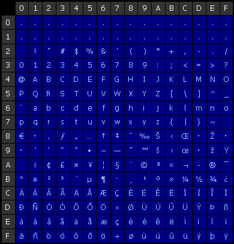

# Furcadia Integer Encoding (base95 & base220)
## Overview
Furcadia uses multiple types of encoding throughout its protocol in order to
transfer numeric values between server and client more efficiently in an
otherwise plain text protocol:

| Encoding              | Range / Offset | Order        |
| :-------------------- | :------------: | ------------ |
| base10 (decimal text) | `0x30 .. 0x39` | `MSDF (001)` |
| base95                | `0x20 .. 0x7E` | `MSDF (  !)` |
| base220               | `0x23 .. 0xFE` | `LSDF ($##)` |

* **MSDF** - Most Significant Digit First
* **LSDF** - Least Significant Digit First

### Efficiency
The efficiency gained by these two systems compared to plain text decimal is
as follows:

|              Encoding | 1 digit | 2 digits | 3 digits |   4 digits |
| --------------------: | ------: | -------: | -------: | ---------: |
| text decimal (base10) |      10 |      100 |     1000 |      10000 |
|                base95 |      95 |     9025 |   857375 |   81450625 |
|               base220 |     220 |    48400 | 10648000 | 2342560000 |
|      binary (base256) |     256 |    65536 | 16777216 | 4294967296 |

> Essentially, we can cram many more numbers into less bytes this way...

## Code
### base95
```python
G_BASE95_OFFSET = 0x20  # b' '

def b95_encode(n: int, min_size: int = 0) -> bytes:
    """Encode a non-negative integer into base95 bytes

    :param n: non-negative integer
    :param min_size: (optional) minimum output length
    :return: base95 bytes representing the given number
    :raises TypeError: if n is not int
    :raises ValueError: if n is negative
    """
    if not isinstance(n, int):
        raise TypeError(f"expected int, got {type(n).__name__} ({n!r})")
    if n < 0:
        raise ValueError(f"expected non-negative number, got {n!r}")
    elif n == 0:
        return b'\x20'  # handle zero values faster without list operations

    buffer: list[int] = []
    while n > 0:
        n, digit = divmod(n, 95)
        buffer.append(digit + G_BASE95_OFFSET)

    # pad the list to accommodate min_size
    buffer.extend([G_BASE95_OFFSET]*(min_size - len(buffer)))

    # reverse the list to match order
    return bytes(reversed(buffer)) 

def b95_decode(b95: bytes) -> int:
    """Decode a base95 number into an integer

    :param b95: base95 number (as bytes)
    :return: numeric representation of the base95 number
    :raises TypeError: if b95 is not bytes
    """
    if not isinstance(b95, bytes):
        raise TypeError(f"expected bytes, got {type(b95).__name__} ({b95!r})")

    multiplier = 1
    n = 0
    for digit in reversed(b95):
        n += multiplier * (digit - G_BASE95_OFFSET)
        multiplier *= 95

    return n
```

### base220
```python
G_BASE220_OFFSET = 0x23  # b'#'

def b220_encode(n: int, min_size: int = 0) -> bytes:
    """Encode a non-negative integer into base220 bytes

    :param n: non-negative integer
    :param min_size: (optional) minimum output length
    :return: base220 bytes representing the given number
    :raises TypeError: if n is not int
    :raises ValueError: if n is negative
    """
    if not isinstance(n, int):
        raise TypeError(f"expected int, got {type(n).__name__} ({n!r})")
    if n < 0:
        raise ValueError(f"expected non-negative number, got {n!r}")
    elif n == 0:
        return b'\x23'  # handle zero values faster without list operations

    buffer: list[int] = []
    while n > 0:
        n, digit = divmod(n, 220)
        buffer.append(digit + G_BASE220_OFFSET)

    # pad the list to accommodate min_size
    buffer.extend([G_BASE220_OFFSET]*(min_size - len(buffer)))
    return bytes(buffer)

def b220_decode(b220: bytes) -> int:
    """Decode a base220 number into an integer

    :param b220: base220 number (as bytes)
    :return: numeric representation of the base220 number
    :raises TypeError: if b220 is not bytes
    """
    if not isinstance(b220, bytes):
        raise TypeError(f"expected bytes, got {type(b220).__name__} ({b220!r})")

    multiplier = 1 
    n = 0 
    for digit in b220:
        n += multiplier * (digit - G_BASE220_OFFSET)
        multiplier *= 220

    return n
```

## base95 vs. base220
base95 was the initial way integers were encoded in the Furcadia protocol.
It uses only printable characters and only 7 bits of each byte.

base220 was introduced in Update 023 and used 8 bits. Some non-printable
characters were now included. See [base220.pdf](base220.pdf) for the official
info available on this encoding.

## base220 strings
The official document mentions "base220 strings", which are strings whose
length is provided as the first byte in a base220 form (e.g., `/Hello world!`,
where `/` means `12`). Such strings may appear in some places within the
protocol.

## Reference
* [base220.pdf](../official/base220.pdf) - official base220 encoding documentation
* [Furcadia Numeric Converter](https://ftr.icerealm.org/ref-numeric) - Furcadia Technical Resources

### ASCII Table

